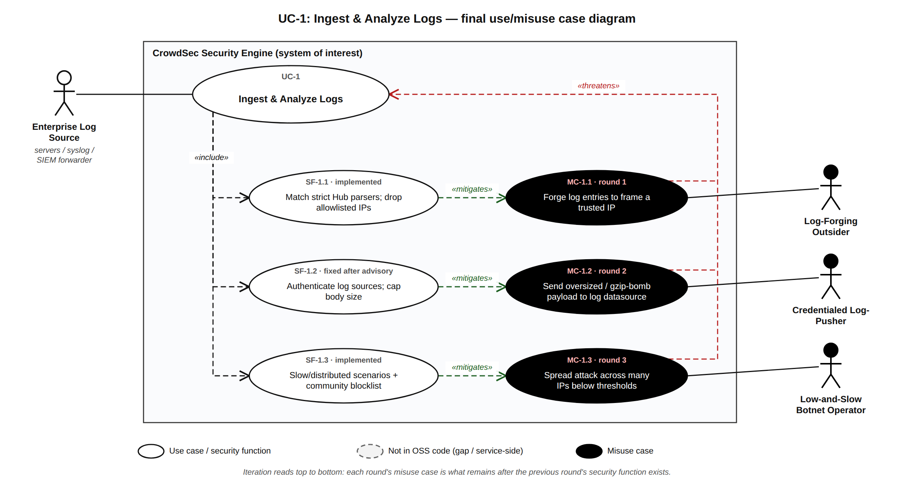
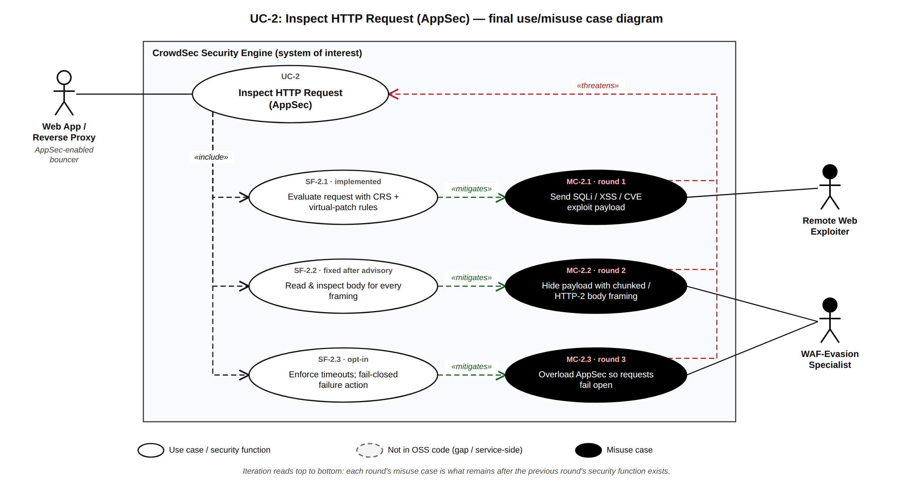
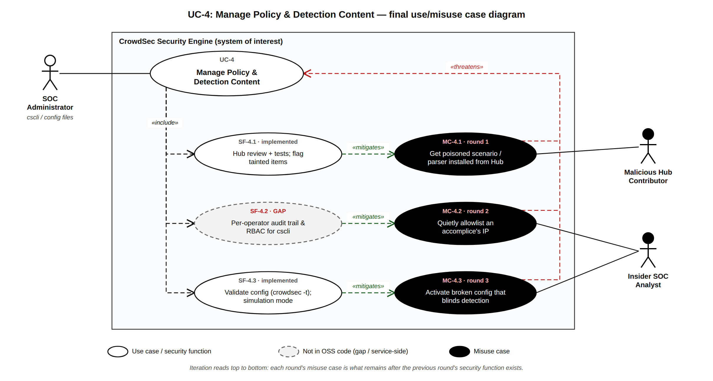
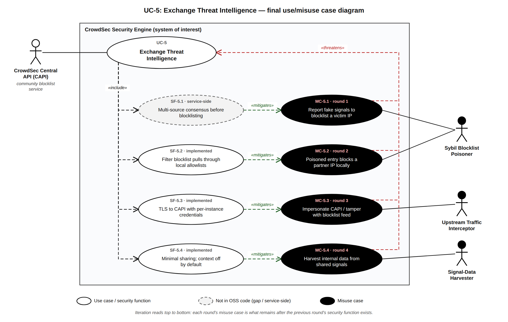
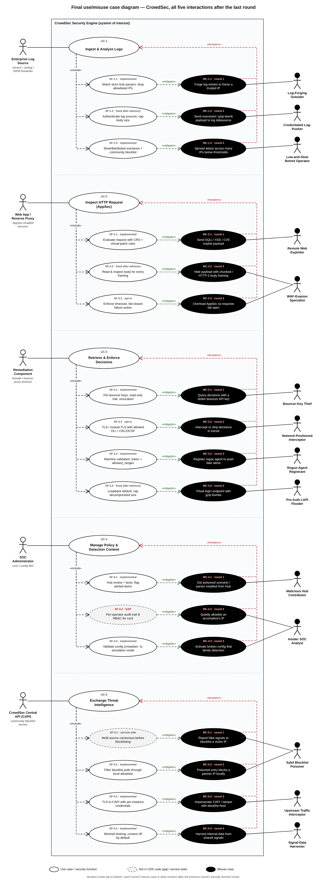

# Requirements for Software Security Engineering — Issues #3 & #4

CSCI-8420 Group 2 · System of interest: CrowdSec Security Engine (v1.8.x) · Environment: enterprise network (multi-server LAPI)

This section continues the five interactions identified in Issue #1 and diagrammed in Issue #2. Issue #3 performs the misuse case analysis and derives security requirements; Issue #4 documents how we used an AI assistant to iterate on the use/misuse cases and presents the final diagrams.

The editable source for every diagram is [`CrowdSec_Use_Misuse_Cases.drawio`](../resources/static/issue3-4/CrowdSec_Use_Misuse_Cases.drawio) (one page per use case plus a page with the complete final diagram). Open it in [app.diagrams.net](https://app.diagrams.net) with *File → Open from → Device*.

| # | External actor | Use case (CrowdSec feature) |
|---|---|---|
| UC-1 | Enterprise Log Source (servers, syslog, SIEM forwarder) | Ingest & Analyze Logs — acquisition, parsers, scenarios |
| UC-2 | Web App / Reverse Proxy (AppSec-enabled bouncer) | Inspect HTTP Request — AppSec / WAF |
| UC-3 | Remediation Component (firewall or reverse-proxy bouncer) | Retrieve & Enforce Decisions — LAPI decisions API |
| UC-4 | SOC Administrator (cscli, config files) | Manage Policy & Detection Content — cscli, Hub, allowlists |
| UC-5 | CrowdSec Central API (CAPI) | Exchange Threat Intelligence — signals and community blocklist |

---

## Issue #3 — Misuse Case Analysis and Derived Security Requirements

### 3.1 Method and notation

We used standard use/misuse case notation (Sindre & Opdahl):

- **White ellipse** = use case or security function (security use case). **Black ellipse** = misuse case.
- **White actor** = legitimate external actor. **Black actor** = misuser.
- `«include»` links a use case to a security function it depends on, `«threatens»` links a misuse case to the use case it attacks, and `«mitigates»` links a security function to the misuse case it counters.

For each use case we iterated in **rounds**. Round 1 starts from the most obvious misuse of the feature. We then added a security function that CrowdSec itself implements, asked *"once this control exists, what can an attacker still do?"*, and added the answer as the next round's misuse case. We stopped when the remaining misuse would require a control outside CrowdSec. In each diagram, rounds read top to bottom.

Following the guidance, we preferred mitigations **implemented by the OSS project**. Each security function carries a status tag:

| Tag | Meaning |
|---|---|
| **implemented** | Present in the CrowdSec engine or its official bouncers, on by default. |
| **opt-in** | Implemented, but the operator must enable it (default is weaker). |
| **fixed after advisory** | Was a gap; closed after a published GitHub Security Advisory. |
| **service-side** | Performed by CrowdSec SAS's hosted service, so not verifiable in the OSS repo. Drawn dashed. |
| **GAP** | Not implemented; required by our analysis. Drawn dashed. |

### 3.2 Misuser catalog

Misuser names are chosen to tell the reader the motive, the access, and the attack. Threat IDs refer to the threat list in our proposal: **T1** LAPI/agent compromise, **T2** stolen credentials/API keys, **T3** malicious logs and crafted HTTP, **T4** poisoned detection content, **T5** bouncer compromise/spoofing, **T6** dependency vulnerabilities, **T7** denial of service.

| Misuser | Motive | Resources | Access to the system | Attack of choice | Threat |
|---|---|---|---|---|---|
| **Log-Forging Outsider** | Get CrowdSec to ban a partner, admin, or payment-gateway IP (self-inflicted DoS), or hide their own IP | Scripts, knowledge of common log formats | Unauthenticated; controls text written into logs (usernames, URLs, User-Agent, X-Forwarded-For) | Log injection / source spoofing | T3 |
| **Credentialed Log-Pusher** | Crash the agent to blind detection before a real intrusion | Log-shipper credential stolen from a compromised app server | Network reach to HTTP / Kubernetes-audit acquisition endpoints | Oversized or gzip-bomb bodies (CWE-409/770) | T3, T7 |
| **Low-and-Slow Botnet Operator** | Brute-force or spray credentials without tripping detection | Botnet or residential-proxy pool with thousands of IPs | Public login endpoints only | Distributed attack kept under bucket thresholds | T3 |
| **Remote Web Exploiter** | Data theft or RCE on public web apps | Public exploit kits and scanners | Unauthenticated internet HTTP | SQLi, XSS, CVE exploit payloads | T3 |
| **WAF-Evasion Specialist** | Get a known-bad payload past the WAF | Knowledge of HTTP parser differentials; load tools | Unauthenticated internet HTTP | Alternate body framing; overloading AppSec so it fails open | T3, T7 |
| **Bouncer-Key Thief** | Learn what is blocked, check whether own IPs are banned, pose as a bouncer | Foothold on one web host | Read access to `/etc/crowdsec/bouncers/*.yaml`; network reach to LAPI | Replay of a stolen bouncer API key | T2, T5 |
| **Network-Positioned Interceptor** | Strip ban decisions so attack traffic passes; harvest keys | ARP/DNS spoofing or a compromised switch | Internal segment between bouncers and a network-exposed LAPI | Man-in-the-middle on LAPI traffic | T1, T5 |
| **Rogue-Agent Registrant** | Push fake alerts to unban themselves or ban executives/partners | Leaked auto-registration token | Host inside the network that can reach LAPI | Registering a malicious log processor | T1, T2 |
| **Pre-Auth LAPI Flooder** | Knock LAPI over so no new decisions reach bouncers | Botnet or a single fast host | Network reach to an exposed LAPI, no credentials | Gzip bombs against `/v1/watchers/login` | T1, T7 |
| **Malicious Hub Contributor** | Create false negatives for their own campaign, or false positives at scale | GitHub account, scenario-writing skill | Can open pull requests against the public Hub | Poisoned or subtly broken parser/scenario | T4 |
| **Insider SOC Analyst** | Let an accomplice through, or sabotage detection | Legitimate shell/sudo on the LAPI host | cscli and CrowdSec config files | Quiet allowlist edit; broken config | T1 |
| **Sybil Blocklist Poisoner** | Get a victim's IP blocked by every CrowdSec user | Many cheap VPS instances each running CrowdSec | Legitimate CAPI enrollment | Coordinated fake signals | T4 |
| **Upstream Traffic Interceptor** | Inject or strip community-blocklist entries | DNS hijack or rogue egress proxy | Enterprise's outbound path to CAPI | Impersonating CAPI | T4 |
| **Signal-Data Harvester** | Learn about the enterprise's internal network from shared data | Access to the central service's data (breach or insider) | Receives whatever the engine shares upstream | Mining alert context in signals | *new — found during iteration* |

T6 (dependency vulnerabilities) is not an interaction with an external actor, so it has no use/misuse case. It is handled by the project's Dependabot-managed `go.mod` noted in our proposal.

---

### 3.3 UC-1 — Ingest & Analyze Logs

The Enterprise Log Source feeds log lines to CrowdSec acquisition datasources. Parsers extract fields; scenarios (leaky buckets) decide whether behavior is malicious and raise alerts.

| Round | Misuse case | Misuser | Security function | CrowdSec evidence | Status |
|---|---|---|---|---|---|
| 1 | MC-1.1 Forge log entries to frame a trusted IP | Log-Forging Outsider | SF-1.1 Match strict Hub parsers; drop allowlisted IPs | Grok-based Hub parsers only emit events for lines that match; parser whitelists and [centralized allowlists](https://docs.crowdsec.net/docs/local_api/centralized_allowlists) drop local alerts for listed IPs and log the action | implemented |
| 2 | MC-1.2 Send oversized / gzip-bomb payload to a log datasource | Credentialed Log-Pusher | SF-1.2 Authenticate log sources; cap body size | [GHSA-g2x2-jgfg-pg7g](https://github.com/crowdsecurity/crowdsec/security/advisories/GHSA-g2x2-jgfg-pg7g) (HTTP datasource, CVE-2026-44982) and [GHSA-rh69-4vqj-9gj8](https://github.com/crowdsecurity/crowdsec/security/advisories/GHSA-rh69-4vqj-9gj8) (k8s-audit, fixed 1.8.0) | fixed after advisory |
| 3 | MC-1.3 Spread attack across many IPs below thresholds | Low-and-Slow Botnet Operator | SF-1.3 Slow/distributed scenarios + community blocklist | Hub ships slow-brute-force scenarios (e.g. `crowdsecurity/ssh-slow-bf`) and the community blocklist blocks IPs seen attacking elsewhere | implemented (coverage depends on installed collections) |



*Figure 1 — UC-1 final use/misuse case diagram.*

#### Derived requirements for UC-1

- **SR-1.1** CrowdSec shall extract security-relevant fields (source IP, user, target) only from log lines that fully match an installed parser, and shall discard non-matching lines without raising alerts.
- **SR-1.2** CrowdSec shall suppress alerts and decisions for IPs/ranges on operator-defined allowlists and shall log every suppression.
- **SR-1.3** Network log datasources (HTTP, Kubernetes audit) shall authenticate the sending log source before accepting data.
- **SR-1.4** Every network datasource shall enforce a configurable maximum raw and decompressed body size and a read timeout, rejecting oversize input without terminating the engine.
- **SR-1.5** CrowdSec shall provide scenarios that correlate low-rate activity over long windows and across many source IPs targeting the same account or resource.

### 3.4 UC-2 — Inspect HTTP Request (AppSec)

An AppSec-enabled bouncer forwards each HTTP request to CrowdSec's AppSec component, which evaluates it against WAF rules and returns allow/deny.

| Round | Misuse case | Misuser | Security function | CrowdSec evidence | Status |
|---|---|---|---|---|---|
| 1 | MC-2.1 Send SQLi / XSS / CVE exploit payload | Remote Web Exploiter | SF-2.1 Evaluate request with CRS + virtual-patch rules | AppSec component (Coraza) with the CRS and `crowdsecurity/virtual-patching` configs | implemented |
| 2 | MC-2.2 Hide payload with chunked / HTTP-2 body framing | WAF-Evasion Specialist | SF-2.2 Read & inspect body for every framing | [GHSA-rw47-hm26-6wr7](https://github.com/crowdsecurity/crowdsec/security/advisories/GHSA-rw47-hm26-6wr7) (CVE-2026-44982): versions 1.5.0–1.7.7 skipped the body when `Content-Length` was not positive | fixed after advisory (v1.7.8) |
| 3 | MC-2.3 Overload AppSec so requests fail open | WAF-Evasion Specialist | SF-2.3 Enforce timeouts; fail-closed failure action | Bouncer options `APPSEC_CONNECT_TIMEOUT`, `APPSEC_SEND_TIMEOUT`, `APPSEC_PROCESS_TIMEOUT` and `APPSEC_FAILURE_ACTION=passthrough\|deny`; [default is `passthrough`](https://docs.crowdsec.net/u/bouncers/openresty) | opt-in |



*Figure 2 — UC-2 final use/misuse case diagram.*

#### Derived requirements for UC-2

- **SR-2.1** AppSec shall evaluate the URI, headers, and body of every forwarded request against the enabled rule sets before the bouncer allows it.
- **SR-2.2** AppSec shall read and inspect request bodies for every supported framing (`Content-Length`, `Transfer-Encoding: chunked`, HTTP/2 without `content-length`), with a negative test for each framing.
- **SR-2.3** The AppSec-enabled bouncer shall enforce connect, send, and processing timeouts toward AppSec.
- **SR-2.4** The bouncer shall offer a fail-closed mode (deny when AppSec is unavailable), and every fail-open event shall be logged.

### 3.5 UC-3 — Retrieve & Enforce Decisions

Remediation components authenticate to the Local API (LAPI), pull decisions, and enforce them (drop, ban, captcha). In our enterprise environment LAPI listens on the internal network so many bouncers and agents can reach it.

| Round | Misuse case | Misuser | Security function | CrowdSec evidence | Status |
|---|---|---|---|---|---|
| 1 | MC-3.1 Query decisions with a stolen bouncer API key | Bouncer-Key Thief | SF-3.1 Per-bouncer keys, read-only role, revocation | [LAPI docs](https://docs.crowdsec.net/docs/local_api/intro): bouncers use an API key and can only read decisions; machines can create them. `cscli bouncers add/delete/list` | implemented |
| 2 | MC-3.2 Intercept or strip decisions in transit | Network-Positioned Interceptor | SF-3.2 TLS / mutual-TLS with allowed OU + CRL/OCSP | [TLS auth docs](https://docs.crowdsec.net/docs/local_api/tls_auth): `agents_allowed_ou`, `bouncers_allowed_ou`, OCSP and CRL checks | opt-in |
| 3 | MC-3.3 Register rogue agent to push fake alerts | Rogue-Agent Registrant | SF-3.3 Machine validation; token + `allowed_ranges` | [Multi-server guide](https://docs.crowdsec.net/u/user_guides/multiserver_setup/): machines must be validated, or auto-register with a token **and** allowed IP ranges | implemented |
| 4 | MC-3.4 Flood login endpoint with gzip bombs | Pre-Auth LAPI Flooder | SF-3.4 Loopback default; cap decompressed size | [GHSA-273h-gvwr-c3qj](https://github.com/crowdsecurity/crowdsec/security/advisories/GHSA-273h-gvwr-c3qj) (CVE-2026-44981); LAPI listens on loopback by default | fixed after advisory |


*Figure 3 — UC-3 final use/misuse case diagram.*

#### Derived requirements for UC-3

- **SR-3.1** LAPI shall issue a unique credential per bouncer and allow each credential to be revoked individually.
- **SR-3.2** Bouncer credentials shall only permit reading decisions; creating, changing, or deleting alerts and decisions shall require machine credentials.
- **SR-3.3** LAPI shall record each bouncer's source IP and last-pull time for audit.
- **SR-3.4** LAPI shall support TLS for all agent and bouncer traffic, and mutual-TLS authentication restricted to configured OUs with revocation checking.
- **SR-3.5** A newly registered machine shall not be able to push alerts until an administrator validates it, or until it registers with a secret token from an allowed IP range.
- **SR-3.6** LAPI shall bind to loopback by default and shall bound the decompressed size of every request, including unauthenticated endpoints.

### 3.6 UC-4 — Manage Policy & Detection Content

The SOC Administrator uses `cscli` and configuration files to install Hub content, manage decisions and allowlists, and configure profiles.

| Round | Misuse case | Misuser | Security function | CrowdSec evidence | Status |
|---|---|---|---|---|---|
| 1 | MC-4.1 Get a poisoned scenario/parser installed from the Hub | Malicious Hub Contributor | SF-4.1 Hub review + tests; flag tainted items | Hub PRs are reviewed and run through Hub tests; `cscli` marks locally modified items as *tainted* and [`hub upgrade` will not overwrite them without `--force`](https://docs.crowdsec.net/docs/cscli/cscli_hub_upgrade) | implemented |
| 2 | MC-4.2 Quietly allowlist an accomplice's IP | Insider SOC Analyst | SF-4.2 Per-operator audit trail & RBAC for cscli | `cscli` acts with whatever OS rights the user has and writes directly to the database; we found no per-operator identity or role separation in the documentation we reviewed | **GAP** |
| 3 | MC-4.3 Activate a broken config that blinds detection | Insider SOC Analyst | SF-4.3 Validate config (`crowdsec -t`); simulation mode | `crowdsec -t` tests configuration without starting; `cscli simulation` runs scenarios without issuing decisions | implemented |



*Figure 4 — UC-4 final use/misuse case diagram.*

#### Derived requirements for UC-4

- **SR-4.1** Hub content shall pass automated Hub tests and maintainer review before publication.
- **SR-4.2** `cscli` shall detect and report Hub items whose local content differs from the published version, and shall not overwrite them silently.
- **SR-4.3** Security-sensitive administrative actions (manual decisions, allowlist changes, machine/bouncer add or delete) shall be attributable to an individual operator. *(gap)*
- **SR-4.4** `cscli` shall support separating read-only analyst roles from administrator roles. *(gap)*
- **SR-4.5** CrowdSec shall reject invalid configuration before activation, and shall let new scenarios run in simulation mode before they issue decisions.

### 3.7 UC-5 — Exchange Threat Intelligence

The engine sends signals about local attacks to CrowdSec's Central API and pulls the community blocklist back.

| Round | Misuse case | Misuser | Security function | CrowdSec evidence | Status |
|---|---|---|---|---|---|
| 1 | MC-5.1 Report fake signals to blocklist a victim IP | Sybil Blocklist Poisoner | SF-5.1 Multi-source consensus before blocklisting | Diversity-based trust scoring (see our proposal) runs inside the CAPI service, not in the OSS repo | service-side |
| 2 | MC-5.2 Poisoned entry blocks a partner IP locally | Sybil Blocklist Poisoner | SF-5.2 Filter blocklist pulls through local allowlists | [Allowlists](https://docs.crowdsec.net/docs/local_api/centralized_allowlists) remove listed IPs from blocklist pulls before database insertion | implemented |
| 3 | MC-5.3 Impersonate CAPI / tamper with the blocklist feed | Upstream Traffic Interceptor | SF-5.3 TLS to CAPI with per-instance credentials | CAPI is reached over HTTPS using `online_api_credentials.yaml` | implemented |
| 4 | MC-5.4 Harvest internal data from shared signals | Signal-Data Harvester | SF-5.4 Minimal sharing; context off by default | `console.yaml` defaults in [`pkg/csconfig/console.go`](https://github.com/crowdsecurity/crowdsec/blob/v1.5.3/pkg/csconfig/console.go): `share_context` and `share_manual_decisions` off; `share_custom` and `share_tainted` on | implemented (partially — custom/tainted sharing is on by default) |



*Figure 5 — UC-5 final use/misuse case diagram.*

#### Derived requirements for UC-5

- **SR-5.1** A community-blocklist entry shall require reports from multiple independent, trusted sources before distribution. *(service-side)*
- **SR-5.2** Local allowlists shall be applied to blocklist pulls before any decision is stored.
- **SR-5.3** Every decision shall record its origin (local scenario, cscli, CAPI, list) so that blocklist-derived decisions can be identified and removed selectively.
- **SR-5.4** LAPI-to-CAPI traffic shall use TLS with server-certificate verification and per-instance credentials.
- **SR-5.5** Local detection and already-pulled decisions shall keep working when CAPI is unreachable.
- **SR-5.6** Signals shared upstream shall exclude alert context and manual decisions unless the operator opts in.

### 3.8 Coverage check

- **Every misuse case is mitigated.** Each of the 17 misuse cases has exactly one `«mitigates»` edge. Two of those security functions are not in the OSS code (SF-4.2 GAP, SF-5.1 service-side) and are drawn dashed so the reader can see them.
- **Every proposal threat is covered.** T1 → MC-3.2, 3.3, 3.4, 4.2 · T2 → MC-3.1, 3.3 · T3 → MC-1.1, 1.2, 1.3, 2.1, 2.2 · T4 → MC-4.1, 5.1, 5.2, 5.3 · T5 → MC-3.1, 3.2 · T6 → out of scope (not an actor interaction) · T7 → MC-1.2, 2.3, 3.4.
- **Iteration found a new threat.** MC-5.4 (data exposure through shared signals) was not in our proposal's threat list; it appeared only once we asked what remains after the blocklist feed is authenticated.

### 3.9 Summary of derived requirements

| Status | Requirements |
|---|---|
| Implemented (on by default) | SR-1.1, 1.2, 1.5, 2.1, 2.3, 3.1, 3.2, 3.3, 3.5, 4.1, 4.2, 4.5, 5.2, 5.3, 5.4, 5.5, 5.6 |
| Implemented but opt-in / weaker default | SR-2.4, 3.4 |
| Fixed after a published advisory | SR-1.3, 1.4, 2.2, 3.6 |
| Service-side (not verifiable in OSS) | SR-5.1 |
| **Gap** | SR-4.3, 4.4 |

Statuses are based on CrowdSec's documentation, published security advisories, and the source files cited above.

---

## Issue #4 — AI-Assisted Iteration and Final Diagram

### 4.1 Prompts used

We adapted the instructor's sample prompt. We added two constraints the rubric cares about: mitigations must be CrowdSec features (or be labeled a gap), and misuser names must convey motive and access. We ran the prompt once per use case, then used the follow-up prompt to push the iteration further. The UC-3 run is shown as an example.

```text
You are an expert software security requirement engineer.
Your job is to suggest misuse cases for a particular description of a use case diagram.
Misuse cases need to be introduced in stages as back and forth analysis by introducing
security countermeasures in response to a misuse case.
Prefer countermeasures that the CrowdSec open-source project itself implements, and name the
config option, cscli command, or documentation page. If CrowdSec has no such feature, label
the countermeasure GAP instead of inventing one.
Give every misuser a name that conveys their motive, resources, and access to the system.
Use this text description of a use case for the analysis.
"""
The "Remediation Component" actor (a firewall or reverse-proxy bouncer) is associated with the
"Retrieve & Enforce Decisions" use case of the CrowdSec Security Engine, deployed in a
multi-server enterprise network where the Local API listens on the internal network.
The "Retrieve & Enforce Decisions" use case has an include dependency on
"Authenticate bouncer with API key".
A "Bouncer-Key Thief" misuser performs "Query decisions with a stolen bouncer API key",
which threatens "Retrieve & Enforce Decisions".
"""
```

Follow-up prompt, repeated until the remaining misuse needed a control outside CrowdSec:

```text
Assume the countermeasure from the last stage is in place. What realistic misuse case still
remains against this use case in our enterprise environment? Give the misuser, the misuse
case, the CrowdSec countermeasure (or GAP), and one testable "shall" requirement.
```

We also gave the AI our initial use/misuse cases and asked it to critique them against the assignment rubric (contextualized misusers, OSS-implemented mitigations, depth of iteration).

### 4.2 What the AI review changed

| AI suggestion | Decision | Reason |
|---|---|---|
| Our initial mitigations, such as "Validate and Parse Security Events," are generic and could describe any product | **Accepted** | Each security function now names a CrowdSec mechanism (allowlists, bouncer read-only role, machine validation, `APPSEC_FAILURE_ACTION`, etc.). |
| Our initial version had only one round per use case, which is shallow | **Accepted** | Expanded to 3–4 rounds per use case (17 misuse cases total). |
| Add rogue agent registration to UC-3 | **Accepted after checking** | CrowdSec's own multi-server guide warns that a log processor can push arbitrary alerts and lock you out. |
| Add AppSec fail-open under load to UC-2 | **Accepted after checking** | Bouncer docs confirm the failure action defaults to `passthrough`. |
| Add pre-auth gzip-bomb DoS against LAPI | **Accepted after checking** | Matches GHSA-273h-gvwr-c3qj from our proposal. |
| Add data exposure through shared signals to UC-5 | **Accepted** | Verified the `console.yaml` sharing defaults in source; became MC-5.4. |
| Add per-user login / MFA for cscli as the mitigation for the insider | **Modified** | CrowdSec has no such feature, so we did not present it as a mitigation. Recorded it as GAP SF-4.2 instead. |
| Cryptographically sign every decision | **Rejected** | No such CrowdSec feature; transport integrity for MC-3.2 is covered by TLS/mTLS, which CrowdSec does implement. |
| CrowdSec skips the certificate revocation check when the CRL file is invalid or expired | **Accepted** | Confirmed in the [TLS auth docs](https://docs.crowdsec.net/docs/local_api/tls_auth); a revoked certificate could still be accepted, so this is a fail-open weakness in SF-3.2 worth noting. |
| Encrypt the SQLite database at rest | **Rejected** | This is an environment control (disk encryption), and the rubric asks us to prioritize OSS mitigations. |

### 4.3 Final diagram

Figure 6 is the finished diagram after the last round of iteration. It combines all five interactions, 17 misuse cases, and 17 security functions inside one CrowdSec system boundary. Each band is the same as the matching Figure 1–5, which are easier to read at full size. All six are pages in [`CrowdSec_Use_Misuse_Cases.drawio`](../resources/static/issue3-4/CrowdSec_Use_Misuse_Cases.drawio).



*Figure 6 — Final use/misuse case diagram: all five interactions after the last round.*

### 4.4 Reflection on the AI prompt's usefulness

We ran these prompts with Claude (Anthropic). The AI was most useful as a critic. Adding one rule to the instructor's sample prompt (every countermeasure must be a named CrowdSec feature, or be labeled GAP) stopped it from suggesting generic controls like MFA or disk encryption. It also sent us back to CrowdSec's documentation and advisories, which is where we found the auto-registration warning, the `passthrough` default for AppSec, and the signal-sharing defaults in `console.go`.

The follow-up prompt ("assume the last countermeasure exists — what remains?") was the most valuable part. It made the back-and-forth iteration concrete, and it surfaced things we had not listed in our proposal, data exposure through shared signals (MC-5.4) and the fact that CrowdSec skips certificate revocation checks when the CRL file is invalid or expired.

The biggest lesson was that the AI states things confidently even when they are not true. When it helped assemble this report, it described our notation as the one "used in class" without having seen our class materials, added notes assigning follow-up work to another teammate's issue, and at first labeled a round-1 summary as our "final" diagram. We caught each of these while reviewing and had them corrected. We now treat AI output as a first draft to verify against the documentation and the assignment, not as a finished answer.

---

### References

- CrowdSec Local API authentication — <https://docs.crowdsec.net/docs/local_api/intro>
- TLS authentication — <https://docs.crowdsec.net/docs/local_api/tls_auth>
- Multi-server setup (machine validation, auto-registration) — <https://docs.crowdsec.net/u/user_guides/multiserver_setup/>
- Centralized allowlists — <https://docs.crowdsec.net/docs/local_api/centralized_allowlists>
- `cscli hub upgrade` (tainted items) — <https://docs.crowdsec.net/docs/cscli/cscli_hub_upgrade>
- OpenResty/Nginx bouncer AppSec options — <https://docs.crowdsec.net/u/bouncers/openresty>
- Console sharing defaults — <https://github.com/crowdsecurity/crowdsec/blob/v1.5.3/pkg/csconfig/console.go>
- Security advisories: GHSA-rh69-4vqj-9gj8, GHSA-g2x2-jgfg-pg7g, GHSA-rw47-hm26-6wr7, GHSA-273h-gvwr-c3qj — <https://github.com/crowdsecurity/crowdsec/security/advisories>
- G. Sindre and A. L. Opdahl, "Eliciting security requirements with misuse cases," *Requirements Engineering*, 10(1), 2005.
